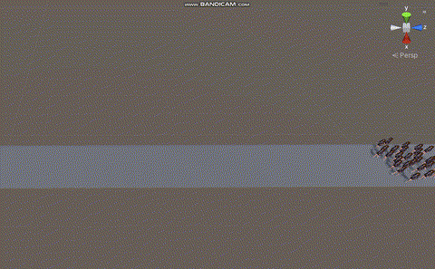
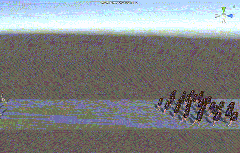

## Crowd Simulation with Unity
In this project, we utilize **Unity®** to simulate crowd behavior with multiple agents in various scenarios, including a train station waiting area and a bi-directional corridor. 

The simulation explores how complex patterns of movement can emerge from simple rules that mimic real-world crowd dynamics. By the end, we create a **crowded scene** with humanoid characters that:  
- Walk around the environment  
- Avoid collisions with each other  
- Move step by step toward their goals

This project demonstrates **agent-based modeling in Unity** for studying and visualizing realistic crowd behavior.

<table>
  <tr>
    <td align="center">
       
      <b>Normal Scene Close-up</b>
    </td>
    <td align="center">
       
      <b>Abnormal Scene Close-up</b>
    </td>
  </tr>
</table>  

<table>
  <tr>
    <td align="center">
       
      <b>Normal Scene Close-up</b>
    </td>
    <td align="center">
       
      <b>Abnormal Scene Close-up</b>
    </td>
  </tr>
</table>  

## Folder Structure
 * [BuildFiles](./BuildFiles)
 * [CSV](./CSV)
   * [Normal]
   * [Abnormal]
 * [Scripts](./Scripts)
   * [DropCylinder.cs](./Scripts/DropCylinder.cs)
   * [ExportCsv.cs](./Scripts/ExportCsv.cs)
   * [Passenger.cs](./Scripts/Passenger.cs)
   * [PoissonArrival.cs](./Scripts/PoissonArrival.cs)
   * [Test.cs](./Scripts/Test.cs)
   * [Wander.cs](./Scripts/Wander.cs)
 
 * [gif](./gif)
 * [images](./images)
 * [README.md](./)

### Dataset
The CSV files contain **time-series data** of agents’ coordinates, acceleration, rotation, and
identity number. 
- The data was exported from the Unity simulation for the **normal** and **abnormal** scenarios - Captured at regular intervals of 0.1 (10 Hz) seconds.
- Each **row** corresponds to a single measurement instance for an agent.
- Each **column** responds to a specific feature.

#### Features
* **t**: time  
*	**x, y, z**: Agen position coordinates
*	**ax, ay, az**: Agent acceleration along x, y, z axes 
*	**rx, ry, rz**: Agent rotation (transform)    
*	**ID**: Unique identifier for each agent

### Unity Environment
The exported data in this CSV file originates from the transform section of the Unity environment, which encompasses the essential attributes of position, rotation, and scale. The position coordinates represent the spatial location of each agent within the simulated environment, while rotation values indicate the orientation around the Y-axis. The scale attribute, not included in this dataset, denotes the dimensions of the agent. 

### Data Format
The CSV file is structured in a comma-separated value format, with each row representing a single measurement of an agent. The column is organized as follows: t, x, y, z, ax, ay, az, rx, ry, rz, ID. 

### Usage
You can use the exported CSV files for a variety of **time-series analysis tasks**, including:
- **Trajectory analysis**: Study the evolution of each agent’s position, acceleration, and rotation over time.  
- **Pattern and anomaly detection**: Identify unusual behaviors or movement anomalies among agents.  
- **Machine learning applications**: Train models to predict anomalies or forecast future agent positions based on historical data

### Scripts
This folder contains the Unity C# scripts that power the simulation for the **train station waiting area**.
* **DropCylinder**:  
*	**ExportCsv**: 
*	**Passenger**:  
*	**PoissonArrival**: The code for controlling the arrival time of the agents in the scene.
*	**Wander**: Script to control the green agents that are wandering around in the scene. 

>  **Disclaimer:** The author is not a professional Unity developer. This simulation is provided "as is" for academic and learning purposes.  

### references
- [Writing XML log files in Unity](https://xeophin.net/en/blog/2010/05/12/writing-xml-log-files-unity-3d-using-c) – Tutorial on exporting files as XML.  
- [Crowd Simulation Course (Unity Learn)](https://learn.unity.com/project/crowd-simulation) – Official Unity Learn project on simulating crowds and fleeing.  
