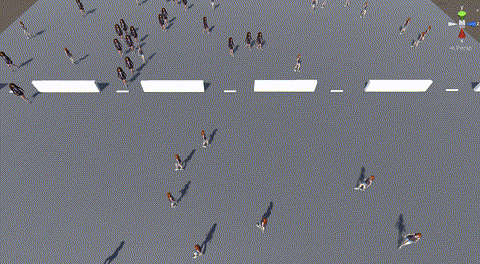

## Overview
In this project, we work with a number of agents to simulate crowd behavior in different scenarios, such as a train station waiting area. We discover how patterns of movement can be formed from the simplest of rules that mimic crowd behavior in the real world. By the end, we have created a crowded scene with humanoid characters walking and avoiding each other as well as reaching their goals one step at a time.

<table>
  <tr>
    <td align="center">
       
      <b>Normal Scene Close-up</b>
    </td>
    <td align="center">
       
      <b>Abnormal Scene Close-up</b>
    </td>
  </tr>
</table>

## Folder Structure
 * [BuildFiles](./)
 * [Scripts](./)
   * [DropCylinder.cs](./Scripts/DropCylinder.cs)
   * [ExportCsv.cs](./Scripts/ExportCsv.cs)
   * [Passenger.cs](./Scripts/Passenger.cs)
   * [PoissonArrival.cs](./Scripts/PoissonArrival.cs)
   * [Test.cs](./Scripts/Test.cs)
   * [Wander.cs](./Scripts/Wander.cs)
 * [CSVFiles](./)
   * [Normal]
   * [Abnormal]
 * [README.md](./)

### Dataset
The CSV files contain time-series data of agents’ coordinates, acceleration, rotation, and
identity. The data was exported from the Unity simulation for the normal scenario and captured at 
regular intervals of 0.1 (10 Hz) seconds. Each row represents a specific 
instance of measurement for an agent, and each column corresponds to a particular data 
attribute. The following attributes are included in the dataset:

* **t**: time  
*	**pX**: X-coordinate of the agent’s position  
*	**pY**: Y-coordinate of the agent’s position  
*	**pZ**: Z-coordinate of the agent’s position  
*	**aX**: Acceleration in the X-axis  
*	**aY**: Acceleration in the Y-axis  
*	**aZ**: Acceleration in the Z-axis  
*	**reX**: Rotation Euler in the X-axis  
*	**reY**: Rotation Euler in the Y-axis  
*	**reZ**: Rotation Euler in the Z-axis  
*	**rtX**: Rotation Transform in the X-axis  
*	**rtY**: Rotation Transform in the Y-axis  
*	**rtZ**: Rotation Transform in the Z-axis  
*	**ID**: Unique identifier for each agent

### Unity Environment
The exported data in this CSV file originates from the transform section of the Unity environment, which encompasses the essential attributes of position, rotation, and scale. The position coordinates represent the spatial location of each agent within the simulated environment, while rotation values indicate the orientation around the Y-axis. The scale attribute, not included in this dataset, denotes the dimensions of the agent. 

### Data Format
The CSV file is structured in a comma-separated value format, with each row representing a single measurement of an agent. The column is organized as follows: t, pX, pY, pZ, aX, aY, aZ, reX, reY, reZ, rtX, rtY, rtZ, ID. 

### Usage
You can utilize these CSV files to perform various time-series analysis tasks, such as:
*	Analyzing the evolution of the agent’s position, acceleration, and rotation over time. 
*	Detecting patterns or anomalies in the movement behavior of agents.
*	Applying machine learning or statistical techniques to predict anomalies or future positions based on historical data.

## Scripts
The Scripts section delves into the codes that power the simulation. It includes explanations of the scripts responsible for simulating passenger behavior and managing events within the virtual train station waiting area.
* **DropCylinder**:  
*	**ExportCsv**: 
*	**Passenger**:  
*	**PoissonArrival**: The code for controlling the arrival time of the agents in the scene.
*	**Wander**: Script to control the green agents that are wandering around in the scene. 
